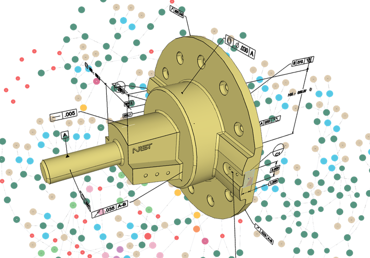

<p align="center">
  
  <h1 align="center">GraphSTEP: concurrent, cloud-based, lifecycle-oriented editing and updating of product data</h1>

  <p align="center">
    <a href="https://www.researchgate.net/profile/Keno-Moenck"><strong>Keno Moenck</strong></a>
    ·
    <a href="https://www.researchgate.net/profile/Adrian-Pustelnik"><strong>Adrian Pustelnik</strong></a>
    ·
    <a href="https://www.researchgate.net/profile/Julian-Koch-10"><strong>Julian Koch</strong></a>
    ·
    <a href="https://www.researchgate.net/profile/Thorsten-Schueppstuhl"><strong>Thorsten Schüppstuhl</strong></a>
    <br />
    Hamburg University of Technology, Institute of Aircraft Production Technology
  </p>

  <h3 align="center">🧾 <a href="http://dx.doi.org/10.1016/j.procir.2023.09.058">10.1016/j.procir.2023.09.058</a></h3>

</p>

## 

The [STEP standard](https://de.wikipedia.org/wiki/Standard_for_the_exchange_of_product_model_data) is a file-/text-based format that is widely used in industry to store product-related data. __GraphSTEP__ transforms STEP-modeled, more specifically, [EXPRESS-modeled](https://en.wikipedia.org/wiki/EXPRESS_(data_modeling_language)) data, into a graph and feeds [Neo4j](https://neo4j.com/) to allow cloud-based data manipulation. __GraphSTEP__ supports the following features

- Transforming a **STEP file to a graph**
- Transforming the **graph back to a STEP file**
- **Manipulation operations** (currently implemented: changing the pose of a part / adding new parts)
- **Filtering operations** (individual branches belonging to basic geometric components or full boundary representations)
- **Version control system** for STEP-based data
- **Access to STEP attributes** of all entities

In a nutshell, it brings your STEP files into the cloud and lets you do operations on it.

## 🏗 Getting Started

Initialize and build external dependencies:
``` sh
./build.sh
```
Build GraphSTEP:
``` sh
mkdir build
cd build
cmake ..
make GraphSTEP -j$(nproc)
```

### Export as native add-on
__GraphSTEP__ contains bindings to `Node.js`, such that you can use it, e.g., in your `Express.js` application:
``` sh
npm ci
npm run build
```

### Neo4j
Docker command to launch Neo4j instance (`NEO4J_AUTH=neo4j/testpassword`):
``` docker
docker run --name neo4j -p7474:7474 -p7687:7687 \
  -d \
  -v $HOME/neo4j/data:/data \
  -v $HOME/neo4j/logs:/logs \
  -v $HOME/neo4j/conf:/conf \
  -v $HOME/neo4j/import:/var/lib/neo4j/import \
  -v $HOME/neo4j/plugins:/plugins \
  --env NEO4J_AUTH=neo4j/testpassword \
  --pull=always \
  --env NEO4J_ACCEPT_LICENSE_AGREEMENT=yes \
  neo4j:enterprise
```

### Neo4j preparations
__GraphSTEP__ (in its current configuration) uses three different graphs to store data:

| Name         | Description                               |
|--------------|-------------------------------------------|
| productgraph | *working graph*, stores the STEP-modeled data of the product |
| macro        | stores filtered graph components |
| history      | stores the version history of the product data |

Create these graphs, e.g., through `Neo4j's` web console:

``` sql
create database productgraph
create database macro
create database history
```

## 🌟 Usage

### Command Line Interface (CLI)

The functionalities of __GraphSTEP__ are exposed in a command line interface:

| Command                          | Description                                                                 |
|----------------------------------|-----------------------------------------------------------------------------|
| `./GraphSTEP read <output directory>` | Transforms the graph back to a STEP file                                    |
| `./GraphSTEP create <file path>`     | Creates a given STEP file into a graph                                      |
| `./GraphSTEP delete`               | Deletes all data of a graph                                                 |
| `./GraphSTEP filter`               | Filters branches belonging to specific nodes                                |
| `./GraphSTEP restoreFilter`        | Loads the filtered data, stored in the macro database, back to the productgraph |
| `./GraphSTEP filter-brep <part name>` | Filters the boundary representation of a part                               |
| `./GraphSTEP restore-brep <part name>` | Loads the filtered boundary representation to the product graph and links it to the desired part |
| `./GraphSTEP add-part <file path> <part name> <assembly name>` | Adds a new part and links it to the assembly |
| `./GraphSTEP duplicate-part <part name> <assembly name>` | Duplicates a given part |
| `./GraphSTEP move-part <part name> <x pos> <y pos> <z pos>` | Moves a part to a desired position |
| `./GraphSTEP version-control-test <data directory>` | Demonstrates a version control pipeline |

### Library
You can bind the `GraphSTEPLib` in your own project. Use [cli.cpp](./cli.cpp) and [CMakeLists.txt](./CMakeLists.txt) as an example.

### Node.js Interface

Import the __GraphSTEP__ addon: 
``` 
var addon = require("bindings")("graphstepAddon");
``` 
- Make sure the addon can be found by your script. Adjust your path if this is not the case.
- Examples for the usage of the addon are contained in the [`examples`](examples) directory.

## ☎ Contact
You are welcome to submit issues, send pull requests, or share some ideas with us. If you have any other questions, please contact 📧: [Adrian Pustelnik](mailto:adrian.pustelnik@tuhh.de).

## ✍ Citation
If you find __GraphSTEP__ useful to your research, please cite our work:
```bibtex
@article{Moenck.2024,
  author = {Moenck, Keno and Pustelnik, Adrian and Koch, Julian and Sch{\"u}ppstuhl, Thorsten},
  year = {2023},
  title = {GraphSTEP: concurrent, cloud-based, lifecycle-oriented editing and updating of product data},
  pages = {678--683},
  volume = {120},
  issn = {22128271},
  journal = {Procedia CIRP},
  doi = {10.1016/j.procir.2023.09.058}
}
```

## 🙏 Acknowledgement
NIST's [SFA](https://github.com/usnistgov/SFA) and [stepcode](https://github.com/stepcode/stepcode) that helped during the course of this work.
